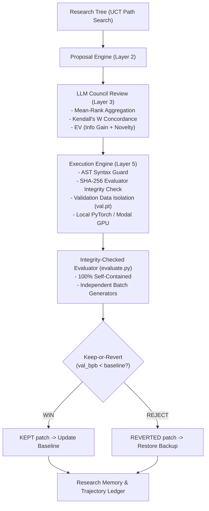

# HypothesisOS: Autonomous Systems Framework for AI-Driven Empirical ML Discovery

HypothesisOS is an empirical ML systems framework designed to execute autonomous deep learning research loops while maintaining strict scientific boundaries, integrity-checked evaluation, and multi-agent peer review consensus.

> **Positioning & Scientific Scope**: HypothesisOS is an empirical systems study and benchmarking framework for compute-normalized ML experiment controllers. The integration of LLM-driven code mutation with multi-agent voting and state-tree search builds directly on established literature in automated machine learning (AutoML) and neural architecture search (NAS). HypothesisOS focuses on empirical controller performance: data isolation, deterministic execution, state-tree UCT search traversal, and multi-model consensus modeling.

---

## Prior Art & Related Work

HypothesisOS builds upon and contrasts with key research in autonomous scientific discovery:

| System / Paper | Paradigm | Comparison & Contrast with HypothesisOS |
| :--- | :--- | :--- |
| **The AI Scientist v2** (*Lu et al., 2025/2026*) | End-to-end scientific paper writing & progressive agentic tree search | Generates full manuscripts; HypothesisOS focuses tightly on verified PyTorch code mutation loops and compute-normalized acquisition controllers. |
| **AI Co-Scientist** (*Gottweis et al., 2025*) | Multi-agent hypothesis generation and literature synthesis | Focuses on domain knowledge synthesis; HypothesisOS focuses on empirical code execution with ground-truth validation. |
| **Consensus-gated Multi-Agent NAS** (*2026*) | Multi-agent voting for neural architecture search | Uses agent voting for NAS; HypothesisOS incorporates Kendall's W concordance, mean-rank aggregation, and information gain into EV scoring. |
| **EvoScientist** (*Lu et al., 2026*) | Evolutionary tree search for scientific discovery | Uses tree-structured experiment expansion; HypothesisOS adopts Upper Confidence bounds applied to Trees (UCT) search over experimental nodes. |
| **AutoResearch** (*Karpathy, 2026*) | Single-agent single-file training loop | Introduced single-file keep-or-revert research loops; HypothesisOS extends this with multi-agent council review and self-contained evaluation boundaries. |

---

## System Architecture



### 1. Integrity-Checked Evaluation Boundary (`evaluate.py`)
- **Self-Contained Evaluation**: `evaluate.py` imports zero objects from `train.py`. It reconstructs its evaluation model directly from `model.pt` checkpoint metadata.
- **SHA-256 Hash Verification**: `orchestrator.py` computes a SHA-256 hash of `evaluate.py` at startup and locks the file with read-only permissions (`chmod 444`). Before every evaluation run, it verifies the SHA-256 hash to prevent code patch tampering.
- **Validation Data Isolation**: `orchestrator.py` security guards explicitly reject code patches that attempt to import or read `data/val.pt` or access `val_bpb` directly.
- **Deterministic Batch Generators**: Uses separate PyTorch `Generator` objects for model initialization versus training/validation batch sampling, ensuring identical evaluation batch sequences across varying model architectures.

### 2. Multi-Agent Peer Review & Consensus Mechanics (`council.py`)
- **Multi-Proposal Anonymized Peer Review**: Candidate code patches are presented simultaneously with randomized labels (`Proposal A`, `Proposal B`, `Proposal C`) to reviewer models.
- **Rank Aggregation via Mean-Rank Scoring**: Reviewer rank orderings are aggregated using mean-rank scores across explicit reviewer model families.
- **Kendall's W Concordance & Disagreement**: Computes Kendall's $W$ coefficient of concordance to quantify true rank agreement ($0.0 \le W \le 1.0$) and rank disagreement ($D = 1.0 - W$).
- **Extended Expected Value (EV) Formula**:
  $$\text{EV} = \frac{P_{\text{success}} \cdot \Delta_{\text{improvement}} + \lambda \cdot I_{\text{info}} + \beta \cdot N_{\text{novelty}}}{C_{\text{cost}}}$$
  Where $I_{\text{info}}$ is information gain, $N_{\text{novelty}}$ is architectural novelty, and $C_{\text{cost}}$ is compute cost.

### 3. Tree-Structured Hypothesis Search (`research_tree.py`)
- **State-Tree UCT Search Expansion**: Replaces greedy branch selection with Upper Confidence bounds applied to Trees (UCT) search traversing parent-child links down the DAG from `root`:
  $$\text{UCT}_v = \frac{w_v}{n_v} + c \sqrt{\frac{\ln n_{\text{parent}}}{n_v}}$$
- **Structured Memory Insights**: Synthesizes proven wins and failure patterns into structured context injected into proposal generation.

---

## Provenance Ledger

| The Empirical Finding / Metric | Exact Script/Notebook Name | Analytical Deduction (What this rules out/forces next) |
| :--- | :--- | :--- |
| Initial baseline validation BPB: `0.1672` (Val Loss: `0.1159`) | `autoresearch/evaluate.py` | Establishes immutable baseline metric for Transformer on TinyShakespeare. |
| Separate `torch.Generator` preserves batch sequences across architectures | `autoresearch/train.py`, `autoresearch/evaluate.py` | Eliminates RNG seed coupling between model size initialization and batch sampling. |
| Evaluator SHA-256 hash locked with `chmod 444` | `orchestrator.py` | Prevents proposed LLM patches from modifying evaluation metrics or evaluation files. |
| Kendall's W Concordance $W \in [0, 1]$ rank agreement calculation | `llm-council/backend/council.py` | Replaces standard deviation of raw utilities with true ordinal rank agreement metric. |

---

## Known Limitations & Scientific Scope

1. **Compute Budget per Trial**: Trials run under fixed wall-clock compute budgets (`TRAIN_TIME_BUDGET_SEC=30s`). Larger architectural modifications may require more budget to show convergence gains.
2. **Dataset Scale**: The default benchmark dataset is TinyShakespeare (~1.1M characters). Findings on small-scale datasets may not directly transfer to multi-billion parameter models trained on OpenWebText.
3. **API Model Diversity**: Consensus concordance metrics ($W$) depend on having diverse underlying LLM reviewer families.

---

## Project Structure

```text
HypothesisOS/
├── config.py                 # System configuration, execution backend, & model choices
├── orchestrator.py           # Main loop with UCB1 search, AST validation & Keep-or-Revert
├── modal_runner.py           # Offloads PyTorch execution to Modal GPU container
├── research_plan.md          # Dynamically updated research plan
├── research_ledger.tsv       # Hard record of Hypothesis -> Expected -> Actual BPB
├── autoresearch/
│   ├── prepare.py            # TinyShakespeare dataset downloader & local fallback
│   ├── train.py              # Mutable PyTorch model & deterministic wall-clock loop
│   └── evaluate.py           # 100% self-contained immutable evaluator (locked chmod 444)
├── llm-council/
│   └── backend/
│       ├── openrouter.py     # Async OpenRouter API client
│       └── council.py        # Peer review with Kendall's W, Borda count & EV scoring
├── memory/
│   ├── research_tree.py      # ResearchTree data structure with UCB1 search & insights
│   └── research_tree.json    # Single authoritative persistent research tree state
└── .agents/                  # System operational rules
```

---

## Quickstart

```bash
# Set OpenRouter API key for live multi-model LLM calls
export OPENROUTER_API_KEY="sk-or-v1-your-key"

# Run autonomous research session (Local Execution)
python orchestrator.py --max-experiments 3 --execution-backend local

# Run autonomous research session (Modal GPU Container)
python orchestrator.py --max-experiments 3 --execution-backend modal
```
